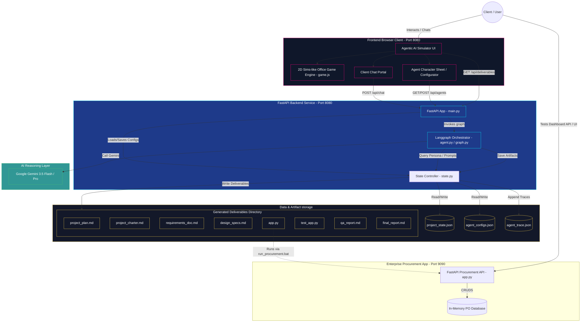
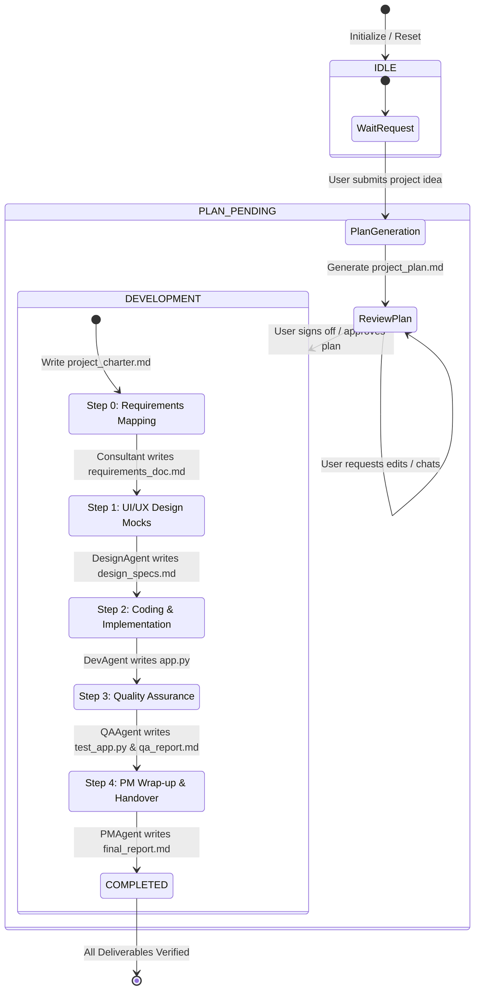

# KPMG Agentic AI Platform: System Architecture

This document details the system architecture, component relationships, data flow, and multi-agent lifecycle of the **KPMG Agentic AI Platform**.

---

## 1. System Overview

The project consists of two primary operational environments:
1. **KPMG Agentic AI Simulator (Port 8080)**: A multi-agent coordination platform featuring a 2D 8-bit office simulator, character customization, and real-time project scoping/delivery orchestration.
2. **Enterprise Procurement Dashboard (Port 9090)**: The target application dynamically generated, implemented, and verified by the Agentic AI Team (`app.py`).



---

## 2. Multi-Agent Langgraph Workflow

The agentic core is designed as an event-driven **Langgraph StateGraph** consisting of explicit nodes for each agent and explicit collaborative edges.



---

## 3. Communication & Execution Control Flow

When a user submits a message, the request flows sequentially through the routing layer, agent execution layer, LLM analysis, and local telemetry storage before updating the simulator canvas.

```mermaid
sequenceDiagram
    autonumber
    actor User as Client Browser
    participant API as FastAPI Server (main.py)
    participant Graph as Langgraph Orchestrator
    participant State as State Manager (state.py)
    participant LLM as Google Gemini API
    
    User->>API: POST /api/chat { message, agent }
    API->>Graph: Invoke AgentState graph
    Graph->>State: Load project_state.json & agent_configs.json
    State-->>Graph: Return active state, active scope, agent personas
    
    alt Project State is IDLE & Request is Scoping
        Graph->>LLM: call_gemini_text() (Generate Project Plan)
        LLM-->>Graph: Return Plan Markdown
        Graph->>State: write_deliverable_file("project_plan.md")
        Graph->>State: Update State to PLAN_PENDING
    else Project State is PLAN_PENDING & Request is Approval
        Graph->>State: Generate & Save project_charter.md
        Graph->>State: Update State to DEVELOPMENT (Step 0)
    else Project State is DEVELOPMENT
        alt Step == 0 (Consultant turn)
            Graph->>LLM: Generate requirements_doc.md
            LLM-->>Graph: BRD Content
            Graph->>State: write_deliverable_file() & increment step
        alt Step == 1 (DesignAgent turn)
            Graph->>LLM: Generate design_specs.md
            LLM-->>Graph: Design specs content
            Graph->>State: write_deliverable_file() & increment step
        alt Step == 2 (DevAgent turn)
            Graph->>LLM: Generate app.py
            LLM-->>Graph: FastAPI code
            Graph->>State: write_deliverable_file() & increment step
        alt Step == 3 (QAAgent turn)
            Graph->>LLM: Generate test_app.py & qa_report.md
            LLM-->>Graph: Tests & QA findings
            Graph->>State: write_deliverable_file() & increment step
        alt Step == 4 (PMAgent turn)
            Graph->>State: Generate final_report.md
            Graph->>State: Update State to COMPLETED
        end
    end
    
    Graph->>LLM: agent_think() (Determine agent's spoken response text)
    LLM-->>Graph: Return JSON { action, response_text, target_agent }
    Graph->>State: append_agent_trace() (Log LLM inputs/outputs/latency)
    Graph-->>API: Return final AgentState dict
    API-->>User: HTTP 200 { action, response_text, project_state }
    Note over User, API: Web Client plays audio sfx, moves sprites,<br/>and updates live progress indicators.
```

---

## 4. Key Component Definitions

### 4.1. The 2D Simulator Game Engine (`game.js`, `assets.js`)
* **Layout Grid**: Built on an $18 \times 25$ cell coordinate space with predefined collision states (walls, desks, lounge couches, elevator).
* **Pathfinding**: Implements a Breadth-First Search (BFS) pathfinder to direct agents from home desks to meetings or break coordinates dynamically.
* **Sound Synthesizer**: Uses standard Web Audio API oscillators (`synth.play()`) to generate custom 8-bit click, coin, powerup, levelup, and success sounds.
* **Character Customization**: Allows editing agent configurations via HTTP POST, which dynamically updates character portraits, stats (HP, MP, XP), and system prompts on the fly.

### 4.2. Langgraph Coordination Engine (`graph.py`)
* **Explicit Graph Nodes**: Node functions are registered explicitly in LangGraph (`workflow.add_node("pm", pm_agent_node)`, etc.) instead of executing within a single mock router node.
* **Conditional Entry & Edges**: The graph routes requests dynamically to the active agent node using `set_conditional_entry_point` and has explicit agent-to-agent edges representing the collaboration cycle (e.g. `dev` $\rightarrow$ `qa` $\rightarrow$ `pm`), yielding to `END` at runtime to support turn-based UI updates.
* **State Machine Persistence**: Synchronizes progress via disk writes so state remains robust across web restarts.
* **Trace Telemetry**: Records every prompt payload, generation timestamp, model, temperature, latency metric, and file change list into `agent_trace.json`.

### 4.3. Client Procurement Dashboard (`app.py`)
* **FastAPI Backend**: Fully modular schemas defining `PurchaseOrderItem`, `PurchaseOrderCreate`, and `DashboardSummary`.
* **Data Layer**: Mock in-memory store simulating transactional purchase actions (IT Hardware, Professional Services, Facilities) and status transitions.

### 4.4. Quality Assurance and Testing (`qa_agent.py`)
* **Pytest Unit Test Suite**: The QA Agent dynamically inspects the generated FastAPI backend code to write clean, executable test suites in `test_app.py`.
* **Code Quality Audit Report**: Performs code evaluations on FastAPI structure, Pydantic validations, and security issues to compile `qa_report.md`.
